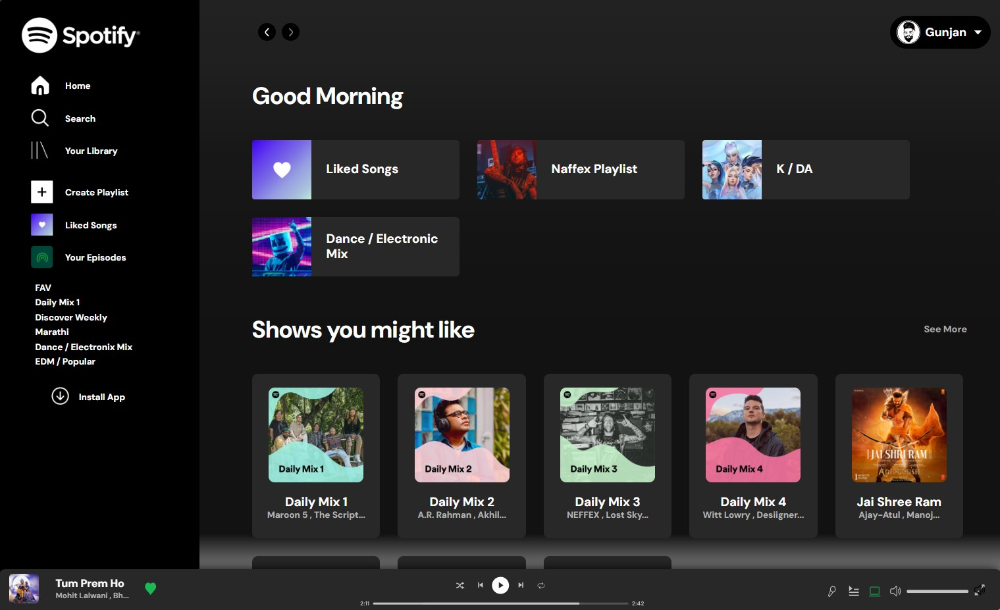

[![Contributors][contributors-shield]][contributors-url]
[![Forks][forks-shield]][forks-url]
[![Stargazers][stars-shield]][stars-url]
[![Issues][issues-shield]][issues-url]
[![LinkedIn][linkedin-shield]][linkedin-url]
<br />
<br />

<!-- PROJECT LOGO -->

<p align="center">
  <a href="https://github.com/Gunjan-dhande/Spotify-Clone">
    
  </a>

  <h3 align="center">Spotify-Clone</h3>
  
  <p align="center">
    <a href="https://gunjan-dhande.github.io/Spotify-Clone/"><strong>Check Its Live</strong></a><br>
    <br />
    <br />
    <a href="https://github.com/Gunjan-dhande/Spotify-Clone">View Code</a>
    ·
    <a href="https://github.com/Gunjan-dhande/Spotify-Clone/issues">Report Bug</a>
    ·
    <a href="https://github.com/Gunjan-dhande/Spotify-Clone/issues">Request Feature</a>
  </p>
</p>


1. Clone the repository:

```bash
https://gunjan-dhande.github.io/Spotify-Clone/
```

## Table of Contents
- [Introduction](#introduction)
- [Description](#description)
- [Features](#features)
- [Technologies Used](#technologies-used)
- [How does it work?](#how-does-it-work)
- [Project Requirements](#project-requirements)
- [License](#license)
- [Contact](#contact)

## Introduction
This is a Spotify clone project aimed at replicating some of the functionalities of the popular music streaming service Spotify.
This project is a clone of the popular music streaming service Spotify. It aims to replicate the core features and user experience of Spotify using modern web development technologies.

## Description
The project aims to mimic the user interface and basic functionality of Spotify, allowing users to browse through a library of songs, create playlists, and play music. It does not aim to replicate the entire feature set of Spotify but rather provide a simplified version for educational and learning purposes.

## Features
- **User Authentication:** Users can sign up, log in, and log out securely.
- **Browse:** Users can browse through a vast catalog of music, organized by genres, artists, albums, and playlists.
- **Search:** Users can search for their favorite songs, artists, or albums.
- **Playback Controls:** Users can play, pause, skip, and control volume of songs.
- **Playlists:** Users can create, edit, and delete their own playlists.
- **Favorites:** Users can mark songs, albums, or artists as favorites for easy access.
- **Responsive Design:** The application is responsive and works well on various screen sizes.

## Technologies Used

- **Frontend:** React.js, Redux, HTML5, CSS3
- **Backend:** Node.js, Express.js, MongoDB
- **Authentication:** JSON Web Tokens (JWT)
- **Audio Playback:** HTML5 Audio API
- **API:** Spotify Web API (for fetching music data)

To use this project, you can clone the repository and follow the installation instructions in the [How does it work?](#how-does-it-work) section.

## How does it work?
The project is built using [insert technologies here], and the setup instructions can be found in the [README.md](./README.md) file of the repository.

## Project Requirements
- [insert required dependencies and technologies here]

## License
This project is licensed under the [insert license here]. See the [LICENSE](./LICENSE) file for details.

## Contact
For any inquiries or feedback, feel free to contact the project maintainer at [insert email here].


<!-- MARKDOWN LINKS & IMAGES -->
<!-- https://www.markdownguide.org/basic-syntax/#reference-style-links -->

[contributors-shield]: https://img.shields.io/github/contributors/jihedkdiss/jSnake.svg?style=for-the-badge
[contributors-url]: https://github.com/Gunjan-dhande/Compressor_Decompressor/graphs/contributors
[forks-shield]: https://img.shields.io/github/forks/jihedkdiss/jSnake.svg?style=for-the-badge
[forks-url]: https://github.com/Gunjan-dhande/Compressor_Decompressor/network/members
[stars-shield]: https://img.shields.io/github/stars/jihedkdiss/jSnake.svg?style=for-the-badge
[stars-url]: https://github.com/Gunjan-dhande/Compressor_Decompressor/stargazers
[issues-shield]: https://img.shields.io/github/issues/jihedkdiss/jSnake.svg?style=for-the-badge
[issues-url]: https://github.com/Gunjan-dhande/Compressor_Decompressor/issues
[linkedin-shield]: https://img.shields.io/badge/-LinkedIn-black.svg?style=for-the-badge&logo=linkedin&colorB=555
[linkedin-url]: https://www.linkedin.com/in/gunjan-dhande
